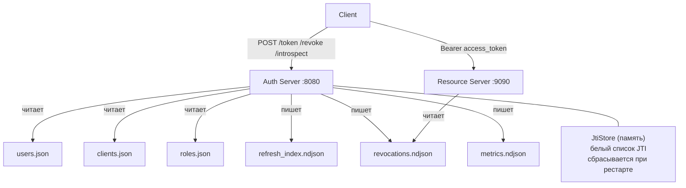

# Mini-OAuth2

Реализация OAuth без специальной библиотеки

## Установка

```bash
python -m venv venv
source venv/bin/activate
pip install -r requirements.txt
```

## Запуск

```bash
# Сгенерировать новый секрет
python -m src.cli.keygen

# Auth-сервер (порт 8080)
uvicorn src.auth_server.main:app --port 8080

# Resource-сервер (порт 9090)
uvicorn src.resource_server.main:app --port 9090
```

## CLI-утилиты

```bash
# Добавить пользователя
python -m src.cli.user_add alice secret123 --roles manager viewer

# Добавить клиента
python -m src.cli.client_add cli-001 secret \
  --grants password client_credentials refresh_token \
  --scopes payments:read payments:write

# Посмотреть роли
python -m src.cli.role_dump
```

## Примеры curl

### Получить токен (password grant)

```bash
curl -s -X POST http://localhost:8080/token \
  -H 'Content-Type: application/json' \
  -d '{
    "grant_type": "password",
    "username": "alice",
    "password": "alice123",
    "client_id": "cli-001",
    "client_secret": "secret",
    "scopes": ["payments:read", "payments:write"]
  }'
```

```json
{
  "access_token": "<compact.signed>",
  "token_type": "bearer",
  "expires_in": 900,
  "scope": "payments:read payments:write",
  "refresh_token": "<opaque-id>"
}
```

### Получить токен (client credentials)

```bash
curl -s -X POST http://localhost:8080/token \
  -H 'Content-Type: application/json' \
  -d '{
    "grant_type": "client_credentials",
    "client_id": "cli-001",
    "client_secret": "secret",
    "scopes": ["payments:read"]
  }'
```

### Обратиться к ресурсу

```bash
curl -s http://localhost:9090/api/payments \
  -H "Authorization: Bearer <access_token>"
```

### Обновить токен

```bash
curl -s -X POST http://localhost:8080/token/refresh \
  -H 'Content-Type: application/json' \
  -d '{
    "grant_type": "refresh_token",
    "refresh_token": "<opaque-id>",
    "client_id": "cli-001",
    "client_secret": "secret"
  }'
```

Старый `refresh_token` после ротации становится недействительным.
Повторное использование возвращает `409 Conflict`.

### Отозвать токен

```bash
# Access-токен
curl -s -X POST http://localhost:8080/revoke \
  -H 'Content-Type: application/json' \
  -d '{"token": "<access_token>", "token_type_hint": "access_token"}'

# Refresh-токен
curl -s -X POST http://localhost:8080/revoke \
  -H 'Content-Type: application/json' \
  -d '{"token": "<refresh_id>", "token_type_hint": "refresh_token"}'
```

### Интроспекция

```bash
curl -s -X POST http://localhost:8080/introspect \
  -H 'Content-Type: application/json' \
  -d '{"token": "<access_token>"}'
```

```json
{
  "active": true,
  "sub": "u-100",
  "client_id": "cli-001",
  "scopes": ["payments:read", "payments:write"],
  "roles": ["manager", "viewer"],
  "exp": 1736187300,
  "aud": "payments-api"
}
```

### Конфигурация сервера

```bash
curl -s http://localhost:8080/.well-known/config
```

## Как всё связано



## Обоснование выбора opaque

Opaque был выбран так как его легко отозвать, ведь его подпись не надо верифицировать.
Так же можно обнаружить повторное использование токена (кража). 
Signed формат тоже требует хранилища для ротации, но усложняет процесс своим парсингом и верификацией.
## Автор
Смолко Алексей
